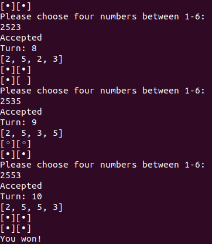

# Mastermind

## Description

A game of Mastermind built with Ruby, playable from the command line.

## Installation

You must have ruby version 2.7.0 >=

## Usage

1. clone this repository to your local machine
2. cd into that directory then run the command

```
  ruby mastermind.rb
```

## Preview



## How to play

- You have to guess the four digit secret code
- You have a total of 9 chances to guess the right code
- Each turn you will be given a hint of how close your guess was
- A empty dot means you guess the right number, but in the wrong position
- A filled dot means you guess the right number and its in the right position
- Have fun!

## Acknowledgment

[The Odin Project](https://www.theodinproject.com/)
